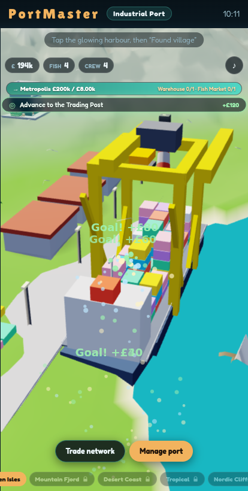

# PortMaster

**[Play PortMaster free →](https://lukasjennings11-ctrl.github.io/Port-Master/games/harbor/)**

PortMaster is a free, browser-based idle tycoon game: found a harbour on a wild coastline and grow
it from a humble fishing village into a global trade empire — build and upgrade a living cartoon
port, send ships on expeditions, weather storms, race a rival baron, and prestige for permanent
multipliers, all rendered in a warm, hand-tuned WebGL2 scene. No install, no account, no paywall —
open the link and play.



## Features

- **Build & grow** — fishing huts, cottages, markets, factories and docks across five hand-authored
  eras (fishing village → global trade hub), each unlocking new buildings, biomes and mechanics.
- **Trade network** — link founded ports together into routes for passive income across the map.
- **Expeditions & relics** — send ships on timed voyages that pay out even while you're away; relics
  drop from voyages and crates, and complete sets grant permanent bonuses.
- **Dynamic events & storms** — choice-driven events and weather hazards that damage and require
  rebuilding your port, keeping every run a little different.
- **The Rival** — Baron Krall periodically challenges you to races for prizes and bragging rights.
- **Legacy & doctrines** — prestige for permanent multipliers, then specialise your next run down a
  branching doctrine tree with capstones and an equippable relic loadout.
- **Daily cadence** — missions, login streaks, a market tide, salvage crates, a daily fortune draw
  and a free seasonal Harbour Pass reward everything you do.
- **Captain's Bonus** — an opt-in, ethically-designed rewarded boost (2× production for 10 minutes)
  behind a pluggable ad-provider abstraction — free on our own site, real rewarded ads on portals.
- **Living world** — ambient boats, gulls, chimney smoke, weather and a full day/night audio and
  lighting cycle that reacts to what you've built.
- **Installable PWA** — add PortMaster to your home screen and keep playing fully offline.

## Tech

- **Zero-dependency WebGL2 renderer** — a small hand-rolled engine (`games/harbor/gl.js`,
  `gltf.js`) with no external rendering libraries; ES5, dependency-free JavaScript throughout.
- **Deterministic simulation core** (`games/harbor/sim.js`) decoupled from rendering, so the whole
  economy can be driven and asserted headlessly.
- **Progressive Web App** — an offline-first service worker (`games/harbor/sw.js`) and manifest
  make it installable and fully playable without a network connection.
- **Portal-ready** — a pluggable `window.ADS` provider abstraction and a `?portal=` mode strip out
  everything web-game portals (Poki, CrazyGames) disallow — service workers, install prompts,
  external links — with zero other behaviour change.
- **Deterministic test suite** — sim/systems tests (Node) plus a full headless-browser integration
  suite (Playwright over swiftshader) drive the game through founding, building, prestige, events,
  audio and rendering, asserting outcomes and zero console errors on every run.

## Run it locally

No build step, no Node dependency to play. From the repo root, serve the folder with any static
file server and open the game:

```bash
python3 -m http.server 8000
# then open http://localhost:8000/games/harbor/
```

## Run the tests

```bash
bash games/harbor/tests/run.sh
```

This runs the deterministic sim/systems suite, the headless browser integration suite, and a
portal pre-flight check — non-zero exit if anything fails.

## Deploy model

`main` is the source of truth. Shipping a build means syncing `main` into the `gh-pages` branch,
which GitHub Pages serves directly — no build step, since the game is plain static HTML/CSS/JS.

## Monetization & go-to-market

See [`MONETIZATION.md`](MONETIZATION.md) for the honest, ordered plan: web-game portals
(Poki/CrazyGames) first, then opt-in rewarded ads, then native app + IAP — and the line we hold on
what we will never do (no loot boxes, no pay-to-win, no dark patterns).
